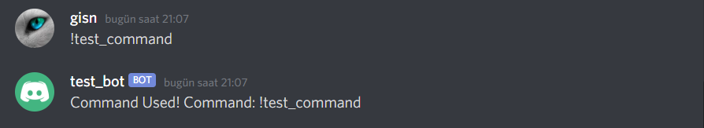

## Ourted: A Discord bot in PHP

The `Ourted` library provides a running bot process written in PHP.

### Installation

```
composer require ourted/ourted
```

Edit ``.env`` and configure bot token


Examples
---

#### More documents in example/Ourted.php


Without Event Listener
```php
<?php

require_once __DIR__ . '/vendor/autoload.php';

use Dotenv\Dotenv;
use Ourted\Bot;

class Ourted extends Bot
{

    public $token;

    public function __construct()
    {
        $dotenv = Dotenv::createImmutable(__DIR__);
        $dotenv->load();
        $this->token = $_ENV['BOT_TOKEN'];
        parent::__construct($this->token, '!');
        $this->setBot();
    }

    public function setBot()
    {
        echo "Hello World\n";
        $this->run();
    }
}

new Ourted();
?>
```

Result Log: 
---


---
With Event Listener

```php
<?php

require_once __DIR__ . '/vendor/autoload.php';

use Dotenv\Dotenv;
use Ourted\Bot;

class Ourted extends Bot
{

    public $token;

    public function __construct()
    {
        $dotenv = Dotenv::createImmutable(__DIR__);
        $dotenv->load();
        $this->token = $_ENV['BOT_TOKEN'];
        parent::__construct($this->token, "!");
        $this->setBot();
    }

    public function setBot()
    {
        // Ready Event Listener
        $this->addListeners(
            "EventListener"
        );
        echo "Hello World\n";
        $this->run();
    }
}

class EventListener extends \Ourted\Interfaces\EventListener
{

    public function onMessageCreate($json, $bot)
    {
        /* 
        Content: $json->content
        Author Username: $json->author->username
        Author Discriminator: $json->author->discriminator
        Author ID: $json->author->id
        */

        if(isset($json->author->bot)){
            return;
        }
        $this->func->sendMessage("Message Sent! By: <@{$json->author->id}>, Content: {$json->content}", $json->channel_id);
    }


}

new Ourted();
?>
```
Result:
---

---
Command
---
```php
<?php

require_once __DIR__ . '/vendor/autoload.php';

use Dotenv\Dotenv;
use Ourted\Bot;

class Ourted extends Bot
{

    public $token;

    public function __construct()
    {
        $dotenv = Dotenv::createImmutable(__DIR__);
        $dotenv->load();
        $this->token = $_ENV['BOT_TOKEN'];
        parent::__construct($this->token, '!');
        $this->setBot();
    }

    public function setBot()
    {
        $this->addCommand("test_command", function ($bot, $command_name){
            new TestCommand($bot, $command_name);
        });
        $this->run();
    }
}
class TestCommand extends Command{

    public function execute($json, $bot){
        $bot->functions->sendMessage("Command Used! Command: {$json->content}", $json->channel_id);
    }
}

new Ourted();
?>
```
Result:
---


---

Delete Message
---

````php
<?php

require_once __DIR__ . '/vendor/autoload.php';

use Dotenv\Dotenv;
use Ourted\Bot;

class Ourted extends Bot
{

    public $token;

    public function __construct()
    {
        $dotenv = Dotenv::createImmutable(__DIR__);
        $dotenv->load();
        $this->token = $_ENV['BOT_TOKEN'];
        parent::__construct($this->token, '!');
        $this->setBot();
    }

    public function setBot()
    {


        // Get Channel
        $channel = $this->functions->get_channel(CHANNEL_ID);

        // Delete Messages
        $message = $func->getMessage($channel, MESSAGE_ID);
        $func->deleteMessage($message);


        $this->run();
    }
}

new Ourted();
?>
````


